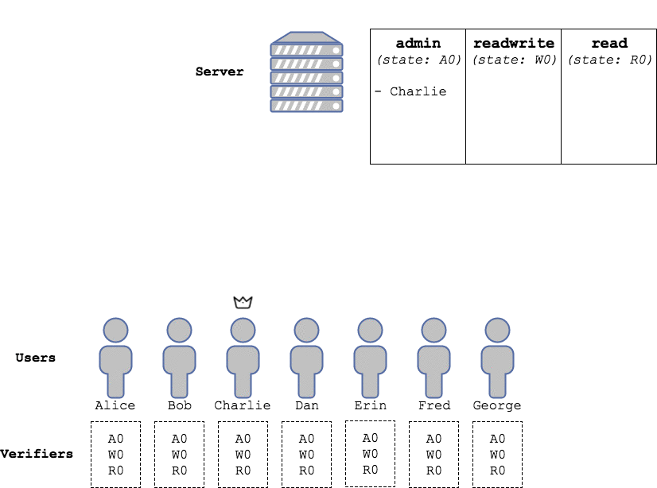
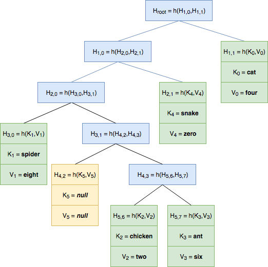
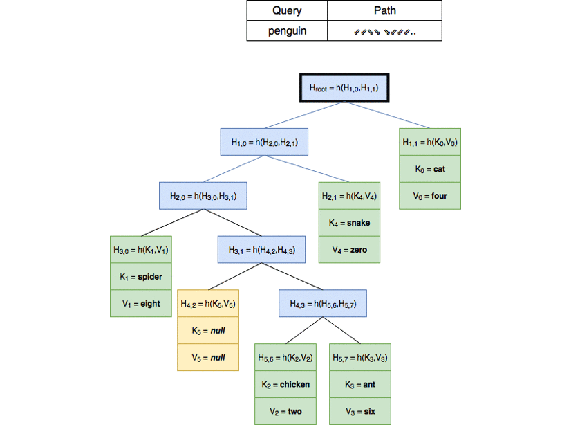

# collections

<!---[](https://travis-ci.org/dedis/student_17_collections)
[](https://codecov.io/gh/dedis/student_17_collections/branch/develop)-->

A `collection` is a Merkle-tree based data structure to securely and verifiably store *key / value* associations on untrusted nodes. The library in this package focuses on ease of use and flexibility, allowing to easily develop applications ranging from simple client-server storage to fully distributed and decentralized ledgers with minimal bootstrapping time.

## Table of contents

- [Overview](#overview)
   * [Basic use example](#basic-use-example)
      + [The scenario](#the-scenario)
      + [The `collection` approach](#the-collection-approach)
   * [Hands on](#hands-on)
      + [Getting started](#getting-started)
      + [Creating a `collection` and a `verifier`](#creating-a-collection-and-a-verifier)
      + [Manipulators](#manipulators)
      + [`Record`s and `Proof`s](#records-and-proofs)
- [Design](#design)
   * [Collections and trees](#collections-and-trees)
      + [Hasing tuples](#hashing-tuples)
      + [Merkle trees and key value stores](#merkle-trees-and-key-value-stores)
      + [Values and sharding](#values-and-sharding)

## Overview

### Basic use example

Here we present a simple example problem, and discuss how it can be addressed by using a `collection`, without discussing implementation details, but rather focusing on the high-level features of a `collection` based storage. 

More advanced scenarios will be introduced in later sections of this document. If you prefer to get your hands dirty right away, you can jump to the [Hands on](#hands-on) section of this README.

#### The scenario

The users of an online community want to organize themselves into three groups with different permission levels: `admin`, `readwrite` and `readonly`. Users in the `admin` group can, e.g., read and write documents, and update the permission level of other users (`admin`s included); users with `readwrite` access can, e.g., update documents but not change privileges; and `readonly` users can, e.g., only read documents.

A server is available to the users to store and retrieve information. However, the server is managed by a third party that the users don't trust. Indeed, they will assume that, if it will have the opportunity to do so, the server will maliciously alter the table of permission levels in order, e.g., to gain control of the community.

#### The `collection` approach

As we will see in the next sections, organizing data in a `collection` allows its storage to be outsourced to an untrusted third party. In short:

 - Every `collection` object stores, at least, an *O(1)* size *state* (namely, the label of the root of a Merkle tree, see later).
 - The *state* of a `collection` uniquely determines **all** the *key / value* associations that the `collection` *can* store. However, a `collection` can actually store an arbitrary subset of them. In particular, we will call `verifier` a `collection` that stores no association (note how a `verifier` is therefore *O(1)* in size).
 - A `collection` storing an association can produce a `Proof` object for that association. A `Proof` proves that some *association* is among those allowed by some *state*. Provided with a `Proof` that starts with its *state*, a `collection` can verify it and, if it is valid, use it to add the corresponding associations to the ones it is storing.
- A `collection` can alter the associations it is storing by adding, removing and changing associations. This, however, changes the *state* of the `collection`.
- One or more `Proof`s can be wrapped in an `Update` object. Provided with an `Update` object, a `collection` can:
   * Verify all the proofs contained in it and use them, if necessary, to extend its storage with the associations it wasn't storing.
   * Verify that some update is applicable on the associations contained in the `Proof`. What constitutes a valid `Update` clearly depend on the context where `collection`s are used. Indeed, a ledger can be defined as a set of allowed `Update`s.
   * Apply the `Update`, thus producing a new *state* for the `collection`.
   * Drop all the associations it is not willing to store. Remember that *as long as it keeps track of the state, the changes applied to the associations will be permanent!*.

Our users can therefore make use of the untrusted server as follows:

 * The untrusted server will store one `collection` for each group. Each `collection` will associate no value to each key. Therefore each `collection` will, in practice, represent a set, just like a `map[string]struct{}` can be used to store a set of `string`s.
 * Each user will run a `verifier` for each group, storing only the fixed size *state*.
 * `Update`s to each `collection` will be broadcasted to all `verifier`s, that will check them and update their *state* accordingly.
 * Users will be able to query the server, and use their `verifier`s to verify that it provides honest answers.




You can also analyze the example [one frame at a time](example.md).

### Hands on

If you are already familiar with the basic notions behind a `collection`, and just need to get started, this section is what you are looking for. If you need a better understanding of how a `collection` works, you might want to skip this section for now, and dive in [Design](#design), where you will find all the information you need to bootstrap yourself in the world of `collection`s.

#### Getting started

To install this library, open a terminal `go get` it:

```bash
go get github.com/dedis/student_17_collections
```

Done? Great. Now you just need to import it:

```go
import collections "github.com/dedis/student_17_collections"
```

That's all. You are ready to go. Remember, from now on, we will use `collections` as the name of the package.

#### Creating a `collection` and a `verifier`

The simplest way to get a `collection` and a `verifier` is:

```go
my_collection := collections.New()
my_verifier := collections.NewVerifier()
```

This will give you an empty `collection` with no fields (i.e., just a set, as we have seen in [Basic use example](#basic-use-example)), and an empty `verifier`, also with no fields. By empty, here, we mean that the states of `my_collection` and `my_verifier` are the same, and that no record whatsoever can be proved from them.

If you wish to specify one or more value types that you want to be associated to each key, you can provide one or more `field`s to the constructors. You are free to define your own value types (see [Defining custom fields](#defining-custom-fields)) but we provide some that are ready to use.

For example, we could create an empty `collection` (and an empty `verifier`) that to each key associate a 64-bit amount of stake and some raw binary data by

```go
my_collection_with_fields := collections.New(collections.Stake64{}, collections.Data{})
my_verifier_with_fields := collections.NewVerifier(collections.Stake64{}, collections.Data{})
```

#### Manipulators

The set of records in a `collection` can be altered using four manipulators: `Add`, `Remove`, `Set` and `SetField`, to add an association, remove one, and set either all or one specific value associated to a key.

In general, you probably want to wrap a set of manipulations on a `collection` in an `Update` object (which also carries proofs: this allows it to be verified and applied also on `collection`s that are not currently storing the records that are being altered, like a `verifier`).

For now, however, let's add some records to our `my_collection_with_fields` and play around with them. Each record, as we said, is an association between a `key` and zero or more values. A `key` is always of type `[]byte` (therefore a `key` can be arbitrarily long!).

The manipulators syntax is pretty straightforward:

```go
my_collection_with_fields.Add([]byte("myfirstrecord"), uint64(42), []byte("myfirstdatavalue")) // Adds an association between key "myfirstrecord" and values 42 and "myfirstdatavalue".
my_collection_with_fields.Add([]byte("anotherrecord"), uint64(42), []byte{}) // Another record with empty data field.

my_collection_with_fields.Remove([]byte("myfirstdatavalue")) // I didn't like it anyway.

my_collection_with_fields.Set([]byte("anotherrecord"), uint64(33), []byte("betterthannothing")) // Note how you need to provide all fields to be set
my_collection_with_fields.SetField([]byte("anotherrecord"), 1, []byte("Make up your mind!")) // Sets only the second field, i.e., the Data one.
```

That's it. Now `my_collection_with_fields` contains one record with key `[]byte("anotherrecord")` and values `(uint64(33), []byte("Make up your mind!"))`.

All manipulators return an `error` if something goes wrong. For example:

```go
err := my_collection_with_fields.Add([]byte("anotherrecord"), uint64(55), []byte("lorem ipsum"))

if err != nil {
	fmt.Println(err)
}
```

Outputs `Key collision.`, since a record with key `[]byte("anotherrecord")` already exists in the `collection`. 

An `error` that all manipulators can return is `Applying update to unknown subtree. Proof needed.`. This happens when you try to manipulate a part of a `collection` that is not locally stored. Remember that, while the allowed set of records a `collection` can store is uniquely determined by its *state*, a `collection` can store an arbitrary subset of them. In particular, as we said, `verifier`s store no association locally, so if you try to

```go
err = my_verifier_with_fields.Add([]byte("myrecord"), uint64(65), []byte("Who cares, this will not work anyway."))

if err != nil {
	fmt.Println(err)
}
```

prints out `Applying update to unknown subtree. Proof needed.`. To manipulate records that are not locally stored by a `collection`, you first need to verify a `Proof` for those records. But all in due time, we will get to that later.

#### `Record`s and `Proof`s

Now that we know how to add, remove and update records, we can discuss what makes a `collection` such a useful instrument: `Proof`s.

##### `Get()`ting a `Record`

Let's first start with something easy. As we said, a `collection` is a *key / value* store. This means that in principle we could use a `collection` as we would use an (unnecessarily slow) Go `map`.

As in any *key / value* store, data can be retrieved from a `collection` by providing a `key`. Following from the `my_collection_with_fields` example, we can try to retrieve two `Record`s, one existing and one non-existing, by:

```Go
another, anothererr := my_collection_with_fields.Get([]byte("anotherrecord")).Record()
nonexisting, nonexistingerr := my_collection_with_fields.Get([]byte("nonexisting")).Record()
```

Now, **attention please!** Here one could expect `anothererr` to be `Nil` and `nonexistingerr` to be some `Error` that says something like: `Key not found`. However, *this is not what those errors are for!* When fetching a `Record`, not finding any association corresponding to a `key` here is not an error: indeed, the retrieval process was completed successfully and no association was found. So both of the above calls will return a `Record` object and no error. 

However, we *can* use `Match()` to find out if an association exists with keys `anotherrecord` and `nonexisting` respectively by

```Go
fmt.Println(another.Match()) // true
fmt.Println(nonexisting.Match()) // false
```

What call to `Get()` can return an `Error`, then? Simple: an `Error` is returned when a `collection` *does not know* if an association exists with the `key` provided because it is not storing it. For example a `verifier`, which does not permanently store any association, when queried as follows:

```Go
another, anothererr = my_verifier_with_fields.Get([]byte("anotherrecord")).Record()
fmt.Println(anothererr)
```

prints out: `Record lies in an unknown subtree.`

Along with `Match()`, a `Record` object offers two useful getters, namely:

```Go
fmt.Println(another.Key()) // Byte representation of "anotherrecord" (just in case you forgot what you asked for :P)

anothervalues, err := another.Values() // Don't worry, err will be non-Nil only if you ask for Values() and Match() is false.
fmt.Println(anothervalues[0].(uint64)) // 33
fmt.Println(anothervalues[1].([]byte)) // Byte representation of "Make up your mind!"
```

Please notice the type assertions! Since each field can be of a different type, `Values()` returns a slice of `interface{}` that need type assertion to be used.

Let us now stop for a second and underline what a `Record` is. A `Record` is just a structure that wraps the result of a query on a `collection`. It just says: "there is an association in this `collection` with key `anotherrecord` and values `33` and `Make up your mind!`", or: "there is no association in this `collection` with key `nonexisting`". You can **trust** that information only because, well, it was generated locally, by a computer that runs your software. However, what if, e.g., someone sent you a `Record` object over the Internet? You couldn't trust what it says more than any other message.

That is why we need `Proof`s.

##### `Get()`ting a `Proof`

So far, we have encountered `verifier`s quite many times, and you are probably wondering what purpose do they serve: they cannot be manipulated, you cannot `Get()``Record`s out of them... apparently, you can only create one and have it sit there for no reason! This is due to the fact that `verifier`s do not store any association, but only the *state* of the collection. However, we said that by just knowing the *state* of a collection, a `verifier` can learn about any association by verifying its `Proof`.

In this section we will not discuss *how* this can happen, but rather focus on how to use `Proof` objects in the context of this library. For more details on how `Proof`s are implemented, jump to <!-- TODO --> [?](?).

First of all, let's wipe the board and start again with an empty `collection` and an empty `verifier`. In this example, we will only have one `Stake64` field to make things less complicated (you can use what you have learned in the previous sections to generalize to a context with more than one field).

```Go
collection := EmptyCollection(Stake64{})
verifier := EmptyVerifier(Stake64{})
```

Now, as we said, `collection` will store all the associations allowed by its *state*, while `verifier` will store no association. However, the *state* of `collection` is identical to that of `verifier`. Let us now `Get()` our first `Proof`:

```Go
proof, err := collection.Get([]byte("mykey")).Proof()
```

Just like `Record`s, `Proof`s are valid even if no association is found with that key. Just like a `Record`, you can

```Go
fmt.Prinltn(proof.Match())
```

and get `false` printed out. Unlike a `Record`, however, a `Proof` is much more than an assertion which you can trust, in general, only if it was generated locally. A `Proof` actually contains a mathematical proof that says: *"association X exists under state Y"*, that can be verified without need of any other inforation. 

A key feature of `collection`s is that they can prove not only the existence of an association, but also its non-existence. In this case, `proof` indeed proves that no association with key `[]byte("mykey")` exists under the state that `collection` and `verifier` share.

Now, let's feed `proof` to `verifier`:

```Go
if verifier.Verify(proof) {
	fmt.Println("Yay!")
}
```

Yes, you guessed right: the above prints out `Yay!`. `proof` was successfully verified because:

 - It is consistent (each step is mathematically valid).
 - It starts with the same *state* as `verifier`, i.e., it proves something about the *state* that `verifier` shares with the `collection` that generated `proof`.

Calling `Verify()` on a `Proof` has not only the effect of returning `true` if the `Proof` is valid. It also serves the purpose to (sometimes temporarily) **extend** the knowledge of the `collection` that verifies it. Since it `Verify()`ed `proof`, `verifier` is storing the information needed to prove that `mykey` does not exist under its state and (see <!-- TODO --> [?](?) to find out why) to **add** a new association with key `mykey` and autonomously compute its new *state* accordingly.

Let's try this out. Indeed, if we try:

```Go
proof, err = verifier.Get([]byte("mykey")).Proof()
```

we get `err == nil`. You can also `Get()` a `Record` if you don't need a `Proof`:

```Go
record, recerr := verifier.Get([]byte("mykey")).Record()
```

Now let's try to use the same manipulator to add a record with key `mykey` to both `collection` and `verifier`:

```Go
err = collection.Add([]byte("mykey"), uint64(42)) // Success
err = verifier.Add([]byte("mykey"), uint64(42)) // Success!!
```

It worked! Thanks to `proof`, `verifier` had temporarily stored enough information to be able to manipulate `mykey`. `verifier` has autonomously recomputed a new *state*, from which the association `mykey -> 42` can be proved! You will notice, however, that if you now try:

```Go
proof, err = collection.Get([]byte("mykey")).Proof()
```

you will successfully get a `proof`, now with `proof.Match() == true`, that proves that `mykey` exists under the new state and is associated to `42`. Buf if you try the same with `verifier`:

```Go
proof, err = verifier.Get([]byte("mykey")).Proof()
```

you will get again the error `Record lies in an unknown subtree.`! What happened? Did `verifier` forget about `mykey`? **Yes**, because that is what `verifier`s are supposed to do: learn about a record only for the time strictly necessary, then forget about everything to save space. A **garbage collection** mechanism is implemented in all `collection`s so that when a record lies outside their `Scope` (see [`Scope`s](#scopes) for more information) it is removed:

 - After any manipulator is called (regardless of the key), if a transaction is not in progress (see [Transactions](#transactions) for more information).
 - At the `End()` of a transaction otherwise.

Let's now go back to `collection` and `verifier` and notice how their *states* are the same: they are still in sync. Now `collection` stores an association, `verifier` doesn't, but can learn about the association when needed without possibility of being fooled: it just needs a `Proof`.

##### Back to the permission levels example

**Congratulations!** Now you have enough knowledge on `collection`s to fully implement the example described in [Basic use example](#basic-use-example). Well, maybe you also need to know that we also made it simple to serialize and deserialize `Proof`s:

```Go
buffer := collection.Serialize(proof) // A []byte that contains a representation of proof. Feel free to send this over the Internet, or with a carrier pigeon!
proofagain, deserializeerr := collection.Deserialize(buffer) // It works, and you get proof again in proofagain
```

On the server side we will generate three `collection`s

```Go
admin := EmptyCollection()
readwrite := EmptyCollection()
read := EmptyCollection()
```

and each verifier will generate three `verifier`s

```Go
admin := EmptyVerfier()
readwrite := EmptyVerifier()
read := EmptyVerifier()
```

(both with no fields, as they represent a set). As key, they will use their public keys. This will also allow them to verify signatures. Now, say that an administrator sends its public key `padm` and a signed `(message, signature)` to add the public key `pwrite` to the `readwrite` `collection`.

On the server side:

```Go
adm, _ := admin.Get(padm).Record() // It will not fail, the collection is storing all the associations.
if adm.Match() {
	// Key padm actually belongs to an administrator!
	// (Verify that signature is valid for message)
	
	proofwrite, _ := readwrite.Get(pwrite).Proof()
	if proofwrite.Match() {
		// Send an error back: pwrite already exists in the readwrite collection, it cannot be added twice!
	} else {
		proofadm, _ := admin.Get(padm).Proof()
		// Broadcast to all verifiers: padm, proofadm, message, signature, pwrite, proofwrite
	}
}
```

And on the client side:

```Go
if !equal(padm, proofadm.Key()) || !(admin.Verify(proofadm)) || !equal(pwrite, proofwrite.Key()) || !(readwrite.Verify(proofwrite)) {
	// We have a cheater here! Return error.
}

if !(proofadm.Match()) {
	// There is no admin with key padm. Return error.
}

if proofwrite.Match() {
	// pwrite is already in the readwrite collection. Return error.
}

// (Verify that signature is valid for message)

readwrite.Add(pwrite)
```

And it's done! Every verifier still stores O(1) data but, provided with a `Proof`, they will always be able to verify that `pwrite` belongs to a user with `readwrite` privileges.

## Design

### Collections and trees

#### Hashing tuples

As we will see, collections make extensive use of a cryptographically secure hash function (namely, `SHA256`). We will need, however, to hash data structures that cannot be canonically serialized into a string, and in general *how* objects are hashed will be of critical importance to the overall security of the protocol.

In this section, we will define a serialization protocol that we will use from now on to express the general notion of hashing a tuple of objects.

##### Allowed types

Let `X0, ..., Xt` be a tuple of objects. Then `sha256(X0, ..., Xt)` is defined and returns a `[32]byte` digest if every `Xi` has one of the following types:

* `bool`
* `int8`
* `int16`
* `int32`
* `int64`
* `uint8`
* `uint16`
* `uint32`
* `uint64`
* `string`

or any slice tensor of the above, of arbitrary order. For example the following types can be provided to `sha256`:

* `[]uint8`
* `[][]string`
* `[][][][]uint64`

Note, however, that `sha256` does **not** accept arrays, so for example `sha256([3]int32{1, 2, 3})` will panic. Moreover, only integer values of known size are accepted: for example, `int` may not have a uniform size across multiple platforms, resulting in different hashes for objects that are semantically identical.

##### Serialization protocol

Cryptographic hash functions are designed to map, in a collision-resistant way, arbitrary-length bitstrings to bitstrings of fixed size (in this case, 32 bytes). In order for `sha256(...)` to be collision-resistant as well, we need to define an injective map between a tuple of objects of arbitrary (allowed) type and the set of finite-length bitstrings. 

This is achieved via a type-aware serialization function (we will call it `serialize` here, in the code it is embedded directly into the `sha256` function) that follows the following rules.

###### Tuples

`serialize(X0, ..., Xt) = serialize(X0) + ... + serialize(Xt)` where `+` denotes the concatenation of bitstrings.

###### Integers and booleans

`serialize(X)`, with `X` integer or boolean, is given by a one-byte unsigned type prefix, followed by a **big endian** encoding its value (booleans are encoded as a one-byte unsigned integer whose value is `0` if the boolean is `false`, and `1` if it is `true`). The type prefix assumes the following values on the allowed types:

 Type    | Prefix | Type    | Prefix | Type    | Prefix |
---------|--------|---------|--------|---------|--------|
`bool`   | 0      | `int8`  | 1      | `int16` | 2      |
`int32`  | 3      | `int64` | 4      | `uint8` | 5      |
`uint16` | 6      | `uint32`| 7      | `uint64`| 8      |

For example: 

 * `serialize(int32(1244)) = 03 00 00 04 dc` (type prefix (3 for `int32`) followed by four bytes representing 1244 in big endian format).
 * `serialize(uint32(1244)) = 07 00 00 04 dc` (same as above, but with different type prefix (7 for `uint32`)).
 * `serialize(uint64(0)) = 08 00 00 00 00 00 00 00 00` (total of nine bytes, one for the type prefix and eight for the value).
 * `serialize(false) = 00 00` (first `00` represents the `bool` type prefix, the second represents the `false` value).
 * `serialize(true) = 00 01` (same as above, `01` represents the value `true`).
 * `serialize(int8(123)) = 01 7b` (one byte for the type prefix, one for the value).

###### Integer and boolean slices

`serialize(X)`, with `X` a slice of integers or booleans (like `[]bool` or `[]uint64` but **not** like `[][]int32`), is given by a one-byte unsigned type prefix, followed by a 64-bit **big endian** encoding of the size of the slice, followed by the concatenation of the encodings of every value in the array. The type prefix assumes the following values on the allowed types:

 Type      | Prefix | Type      | Prefix | Type      | Prefix |
-----------|--------|-----------|--------|-----------|--------|
`[]bool`   | 9      | `[]int8`  | 10     | `[]int16` | 11     |
`[]int32`  | 12     | `[]int64` | 13     | `[]uint8` | 14     |
`[]uint16` | 15     | `[]uint32`| 16     | `[]uint64`| 17     |

For example:

* `serialize([]bool{true, false, true, true, false}) = 09 00 00 00 00 00 00 00 05 01 00 01 01 00` (type prefix (9 for `[]bool`), followed by eight bytes representing the length of the slice (5), followed by the encoding of the five boolean values in the slice).
* `serialize([]int16{1, 2, 3}) = 0b 00 00 00 00 00 00 00 03 00 01 00 02 00 03` (type prefix (11 for `[]int16`), followed by the length of the slice (3), followed by six bytes encoding the three integers).
* `serialize([]byte("Hello World")) = 0e 00 00 00 00 00 00 00 0b 48 65 6c 6c 6f 20 57 6f 72 6c 64` (type prefix (14 for `[]uint8`), followed by the length of the slice (11), followed by the values in the slice (here, the ASCII encoding of `Hello World`)).

###### Strings

`serialize(X)` with `X` a `string` is given by a one-byte type unsigned type prefix with value 18, followed by a 64-bit **big endian** encoding of the size of the slice, followed by the byte representation of the string in ASCII.

For example, following from the previous example we will have `serialize("Hello World") = 12 00 00 00 00 00 00 00 0b 48 65 6c 6c 6f 20 57 6f 72 6c 64` (same as in `serialize([]byte("Hello World"))`, with a different type prefix (18 for `string`).

###### Slices

`serialize(X)`, with X a slice that is not a slice of integers or booleans (like `[][]uint16` or `[]string`, but **not** like `[]bool`) is given by a one-byte unsigned type prefix with value 19, followed by a 64-bit **big endian** encoding of the size of the slice, followed by `serialize(X[0], X[1], ...)`.

Two things can be noted:

 * This allows serialization of slice tensors with arbitrary order and non-uniform dimensionality. For example, we can call successfully compute `serialize([][][]int8{[][]int8{[]int8{1, 2}, []int8{3, 4, 5}, []int8{6, 7, 8, 9}}, [][]int8{}})`.
 * This causes a repetition of type prefixes in contexts where they could be deduced. For example, the type prefix for `string` will appear two times in the output of `serialize([]string{"Hello", "World"})`. Since this repetition has been explicitly optimized for the most common slices, and only occurs for more rare, higher order slice tensors, we don't expect this to be a critical overhead in any real-world scenario.

For example,

```
serialize([][][]int8{
   [][]int8{
      []int8{1, 2}, 
      []int8{3, 4, 5}, 
      []int8{6, 7, 8, 9}
   }, 
   [][]int8{}
})
```

will yield

```
13 // slice
00 00 00 00 00 00 00 02 // Two elements in the slice
   13 // slice
   00 00 00 00 00 00 00 03 // Three elements in the slice
      0a // slice of int8
      00 00 00 00 00 00 00 02 // Two elements in the slice
         01 02 // Elements of the int8 slice
      0a // slice of int8
      00 00 00 00 00 00 00 03 // Three elements in the slice
         03 04 05 // Elements of the int8 slice
      0a // slice of int8
      00 00 00 00 00 00 00 04 // Four elements in the slice
         06 07 08 09
   13 // slice
   00 00 00 00 00 00 00 00 // No elements in the slice
```

##### Hashing

It is easy to see that the protocol described above defines an injection between tuples of objects and bitstrings. Indeed, one can sequentially read a well-formed bitstring output by `serialize` and reconstruct the original object, as types are encoded in type prefixes, variable size objects always have their size explicited before their values, and values are encoded in a way that is platform-independent.

We can finally define `sha256(X0, ..., Xt) = csha256(serialize(X0, ..., Xt))`, where `csha256` is any implementation of the `SHA256` hash on a sequence of bytes.

### Merkle trees and key value stores

It is a known result that data can be organized in a [Merkle tree](https://en.wikipedia.org/wiki/Merkle_tree) to provide the same level of hashing security as a naive serialize-then-hash approach while allowing efficient (usually O(log(N))) random read-write access to arbitrary parts of the data.

Here we will see how a `collection` makes use of Merkle trees to store its associations.

#### Naive approach

We start by noting that a well-formed *key / value* store can be seen as a set of couples `(key, value)` with the property that if `(key1, value1)` and `(key2, value2)` are in the set, then `key1 != key2`.

`collection`s organize these associations on the leaves of a Merkle tree. Here we describe a naive approach to do this and discuss its limitations; in the next section we will see how they can be overcome.

Consider the case where we want to store on a Merkle Tree the following associations: `cat -> four`, `spider -> eight`, `chicken -> two`, `ant -> six` and `snake -> zero`.

We could organize those associations in a Merkle tree as follows:


where `h` is any cryptographically secure hash function like `sha256` (which we described in [Hashing tuples](#hashing-tuples)). Here we have three types of nodes:

 * **Internal nodes** (blue) only have one *label* field `H[i][j]`, `i` being the depth of the node (i.e., number of steps from the root) and `j` being a number between `0` and `2^i - 1`. For internal nodes we have `H[i][j] = h(H[i + 1][2 * j], H[i + 1][2 * j + 1])`.
 * **Leaves** (green) have three fields: a *label* `H[i][j]`, a *key* `K[j]` and a *value* `V[j]`. All leaves have the same depth. For leaves we have `H[i][j] = h(K[j], V[j])`. 
 * **Placeholder leaves** (yellow) are special leaves, whose *key* and *value* fields are `null` (in the code, they will be represented by a zero-length slice of bytes).

##### Usage example

Now, consider a scenario where Alice has a copy of the *key / value* store, and Bob only has a copy of `Hroot`. Bob knows that `Hroot` is the label of the root of a well-formed *key/value* store (as we defined earlier, this means that no key is repeated twice). Now, Bob wants to know what is the value associated to `ant`. He queries Alice which, as in a classical Merkle tree paradigm, replies with the following array: 

```
[
   (H[1][0], H[1][1]), 
   (H[2][0], H[2][1]), 
   (H[3][2], H[3][3]), 
   (K[3], V[3])
]
```

Now Bob can verify that `h(H[1][0], H[1][1]) == Hroot`: since `h` is cryptographically secure this means that both `H[1][0]` and `H[1][1]` are correct. He then proceeds to check `h(H[2][0], H[2][1]) == H[1][0]`, `h(H[3][2], H[3][3]) == H[2][1]` and `h(K[3], V[3]) == H[3][3]`, inductively verifying that `K[3]` and `V[3]` are indeed correct. Now he can check `K[3] == ant` and finally  discover that the well-formed *key / value* store with root label `Hroot` contains the association `ant -> six`.

##### Denying associations

As we have seen in the previous example, it can be easily proven that a malicious Alice will never be able to prove a **false** association from the root label of a well-formed *key / value* store.

However, she can't (efficiently) *deny* the existence of one. Let us imagine that, instead of issuing a query for `ant`, Bob asked Alice about `goat`. What could Alice send to Bob in order to prove that there is no association with key `goat` in the *key / value* store?

Indeed, it is easy to see that the only way to prevent a malicious Alice from hiding the existence of an association is to force her to send to Bob **all** the associations in the *key / value* store!

This is due to the fact that we did not introduce any structure in *how* elements are placed within the tree. Indeed, the associations in the tree above were placed in arbitrary order. 

#### Tree topology

In the previous section we have shown how a trivial Merkle tree approach is not sufficient to efficiently hash a *key / value* store, and implied that some structure needs to be added to *where* the leaf containing each entry should be stored. Here we expand on that idea to get to a complete description of how Merkle trees are implemented in a `collection`.

##### Unique path

Let us go back to the example where Bob knows the root label `Hroot` of a Merkle tree-based *key / value* store that associates to each animal its number of legs, and asks Alice (who has the full tree) for an entry.

In the previous section, we defined a well-formed *key / value* store as a set of associations stored on a Merkle tree, with the only condition of keys being non-repeating. When Bob asks for a proof, therefore, it is completely up to Alice to decide *where* to navigate. If Bob had, however, a way to *know* a priori where Alice should navigate in order to retrieve the key he is asking for, Alice could prove the non-existence of an association just by appropriately navigating where the association *should* be, and show that it isn't there.

This can be easily achieved by noting that the bit expansion of an `n`-bit hash uniquely defines a path of length `n` on a binary tree. Simply put, we can say that a `0` bit means `go to the left child` and a `1` bit means `go to the right child`: as long as the depth of the tree is less than `n` (remember, e.g., `n = 256` in the SHA256 case), this can be used to uniquely map a key to a leaf! Instead of arbitrarily navigating left or right, we can force Alice to:

 * Compute the hash of the key requested by Bob.
 * Use its bit expansion to navigate from the root down until a leaf is encountered.
 * Provide Bob with that leaf and its proof. Note that Bob can autonomously compute the hash of the key he requested, so he can check that Alice navigated honesly along the tree.

Now, if the tree is organized so that every association must lie on a leaf along the path defined by the hash of its key, proving the non-existence of an association `A` reduces to navigating along its path until a leaf is found, and show that it doesn't store `A`!

##### Rules of a `collection` tree

We can now extend the definition of a well-formed, Merkle-tree based *key / value* store to account for path uniqueness. As we will see, we will also add rules to minimize the size of the tree, so as to keep its storage requirements as low as possible. Indeed, we will see how the following set of rules creates a bijection between sets of associations and well-formed trees.

The rules are the following:

 1. As in the previous definition of well-formed *key / value* store, keys form a non-repeating set.
 2. There are three types of nodes:
    * Internal nodes have exactly two children. The root is **always** an internal node.
    * Leaves have no children and store an association.
    * Placeholder leaves have no children and store no association.
 3. An association is always stored on a leaf along the path defined by the bit expansion of the hash of its key (as described in the previous section).
 4. An internal node that is not the root cannot have as children one leaf and one placeholder leaf.

Here, Rule 1 prevents key collisions: the same key cannot appear more than once in the collection. 

Rule 2 defines the types of nodes that are allowed; in particular placeholder leaves proved to be a simpler alternative to defining trees with variable connectivity for internal nodes. 

Rule 3 stems from what we observed in the previous sections: forcing a association to lie on a path defined by the bit expansion of the hash of its key makes it impossible for a prover to deny associations on a well-formed tree. 

Finally, Rule 4 is there to keep the tree as compact as possible. Indeed, we can notice that Rule 3 does not define *one* position in the tree where an association should lie, but rather a set of positions along a *path*. Whenever a leaf `L` and a placeholder `P` are siblings under an internal node `N`, removing `P` and replacing `N` with `L` keeps the association in `L` on the path defined by its key (it just uses one bit less) and saves one placeholder leaf and one internal node, thus making the tree smaller.

Applying Rule 4 means that each association lies along the path defined by its key, but also lies at the smallest depth possible. Since only one tree per set of associations satisfies this property, Rule 4 makes the mapping between sets of associations and trees a bijection.

##### Example tree

Let us now apply the above rules to the example we already discussed, where we want to associate to each animal its number of legs. As we will soon see, a key in a `collection` will be represented by a slice of bytes. We can therefore compute the hash (and therefore the path) for each of `key` by `sha256([]byte(key))`:

Key       | Hash (hex) | Hash (bin)              | Path                  |
----------|------------|-------------------------|-----------------------|
`cat`     | `c7580f..` | `1100 0011 0101 1000..` | ⇘⇘⇙⇙ ⇙⇙⇘⇘ ⇙⇘⇙⇘ ⇘⇙⇙⇙.. |
`spider`  | `09d063..` | `0000 1001 1101 0000..` | ⇙⇙⇙⇙ ⇘⇙⇙⇘ ⇘⇘⇙⇘ ⇙⇙⇙⇙.. |
`chicken` | `33cd78..` | `0011 0011 1100 1101..` | ⇙⇙⇘⇘ ⇙⇙⇘⇘ ⇘⇘⇙⇙ ⇘⇘⇙⇘.. |
`ant`     | `3a236f..` | `0011 1010 0010 0011..` | ⇙⇙⇘⇘ ⇘⇙⇘⇙ ⇙⇙⇘⇙ ⇙⇙⇘⇘.. |
`snake`   | `6d717f..` | `0110 1101 0111 0001..` | ⇙⇘⇘⇙ ⇘⇘⇙⇘ ⇙⇘⇘⇘ ⇙⇙⇙⇘.. |

And then apply Rules 2, 3 and 4 to build the following tree:



As you can see:

 * Internal nodes always have exactly two children.
 * Each association is stored in a leaf that lies on a path determined by the bit expansion of the hash of its key.
 * A leaf and a placeholder leaf are never siblings. Indeed, the only placeholder leaf is sibling of an internal node.

This tree can now be securely navigated to prove either the existence and the non-existence of a key. For example, if we wanted to query the tree for `ant`, we would navigate as follows:


which allows us to produce a proof both for the existence and the value associated to `ant`. If instead we chose to query the tree for `penguin`, which hashes to `38b49e..`, we would navigate as follows:



which allows us to produce a proof for the non-existence of an association for the key `penguin`: indeed, if navigating along the path defined by the bit expansion of the hash of `penguin` yields a leaf that does not contain an association for `penguin`, then no association for `penguin` can exist on a well-formed tree due to Rule 3.

### Values and sharding

In the previous section, we have discussed how a set of `(key, value)` associations can be organized on the leaves of a Merkle tree in order to provide verifiability for both existence and non-exisistence of associations.

Two details, however, still need to be discussed:

 * `collection`s are more than a *key / value* store, as they allow values to be navigated (see [?](?) for how to use this feature in your code).
 * A `collection` can store arbitrary subset of the associations. Indeed, we earlier said that a `verifier` is just a `collection` that does not store any association.

#### Values

As we will see later in code, some fields can be navigated. For example, `Stake64` allows for navigation by cumulative inversion, so that picking a random number between 0 and the total amount of stake in a `collection` minus one, and using that to navigate on the `Stake64` field, will yield a random record, with probability proportional to its amount of stake.

Navigation is in general allowed by propagating values upwards from the leaves up to the root. For example, `Stake64` values propagate up the tree by sum: each internal node will have a value equal to the sum of the values of its children, and placeholder leaves will have value zero.

As we will see in the next section, internal nodes also have (one or more) values.

#### Sharding

Throughout the [Overview](#overview) section of this documentation, we have implied that, while the *state* of a `collection` (which now we know to be the label of the root of a Merkle tree) uniquely determines what associations it **can** store, a `collection` can in general store an arbitrary subset of them. Indeed, we have said that a `verifier` is just a `collection` that permanently stores no association.

This is achieved by adding one last type of node to the mix: the **unknown** node. An *unknown* node is a special kind of node (marked by an appropriate flag) for which only the label is known. It has no children, no key and no values. Turning a node into an *unknown* node allows to save space while still being able to verify proofs, as its content and all its children get deleted.

For example, if we wanted our example `collection` to only store the number of legs for `cat` and `snake`, we could turn the node `(2, 0)` into an unknown node:


As you can see, `H[2][0]` is now a given of the Merkle tree. We don't know if it is the label of an internal node, and if so, what and how many nodes should be under it. We can note, however, that:

 * Rule 2 still applies, as node `(1, 0)` still has two children, one of which is unknown.
 * Rule 3 still applies to all the leaves left: indeed making a node unknown removes all the leaves that appear under it.
 * This `collection` has no information about some associations. However when, e.g., the `collection` is queried for `spider`, its navigation will bring it to an unknown node, and an error can be safely returned (remember the error `Record lies in an unknown subtree.` that we encountered in [`Record`s and `Proof`s](#records-and-proofs)?).
 * This `collection` is still able to form perfectly valid Merkle tree proofs for all the associations it is storing.
 * Whenever provided with a Merkle tree proof that provides information about the node `(2, 0)`, the `collection` can verify its validity and use that information to **restore** its knowledge about that node. This is ultimately how `verifier`s work: they temporarily absorb knowledge learned by Merkle tree proofs, use that knowledge, if necessary, to apply updates and recompute a new Merkle tree root, then they drop all the records they are temporarily storing by making the root unknown. In fact, here is what the tree of a `verifier` looks like:


