## Initial state

States of admin, read/writers, and readers are A0, W0, R0.

## Charlie emits a request adding Erin to admin

## State of "admin" is incremented to A1
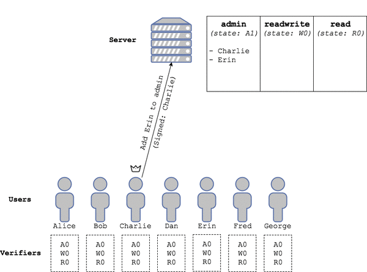

Because Charlie is in the server's admin collection at state A0, the request is valid. State A0 is mutated to A1.

## Server emits proof + state change, floods to all

Proof: Charlie is in A0, thus you are requested to: mutate A0, adding Erin.

## Verifiers accept the proof and mutation
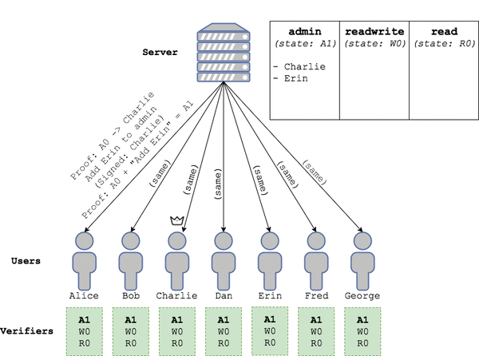

QUESTION: What are they checking?

## New consistent view of state A1

## Erin emits a request adding Dan to RW
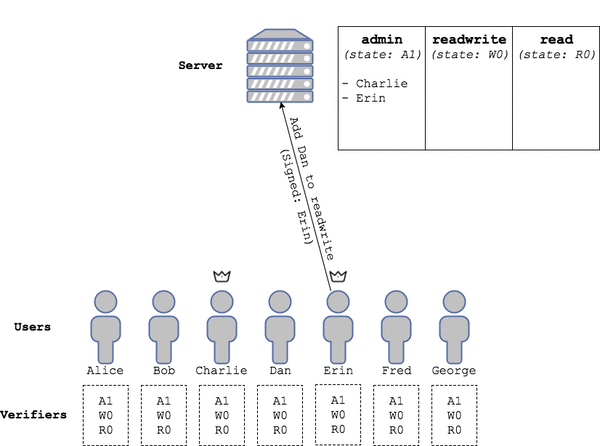

## State of "read/writers" is incremented to W1
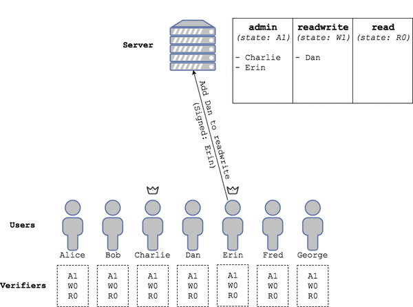

Because Erin is in the admin collection at state A1, the request is valid. State W0 is mutated to W1.

## Server emits proof + state change, floods to all
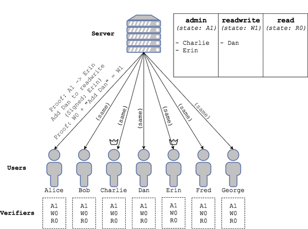

Proof: Erin is in A1, thus you are requested to: mutate W0, adding Dan.

## Verifiers accept the proof and mutation

## Consistent view of read/writers state == W1

## Erin emits request to add Alice to RW

## State of "Read/writers" is incremented to W2

Because Erin is in A1, the request is valid. State W1 is mutated to state W2.

## Proof and mutation W1->W2 flooded
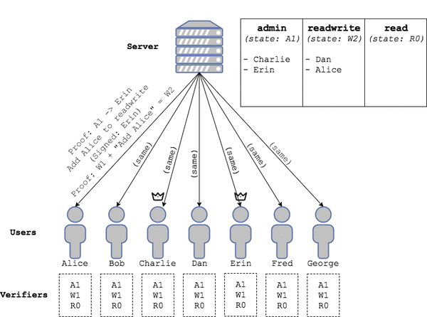

Proof: Erin is in A1, thus you are requested to: mutate W1 adding Alice.

## Verifiers accept the proof and mutation
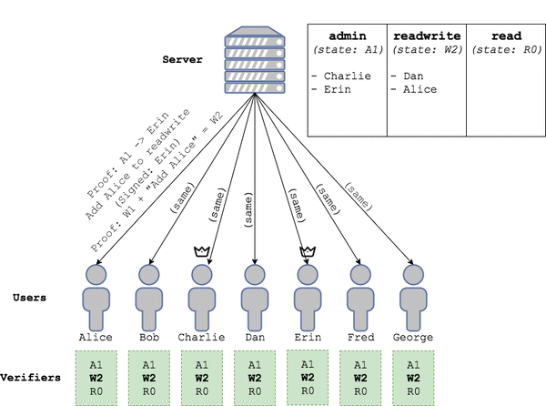

## Consistent view of read/writers state == W2
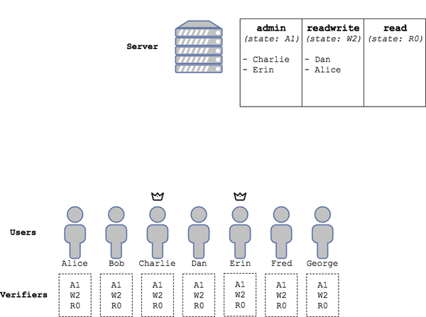

## Charlie emits a request "moving" Dan to read

QUESTION: What is this new "move" verb? It seems like it is an Update which atomically combines a delete and an add?

## State of readers is incremented to R1, read/writers to W3
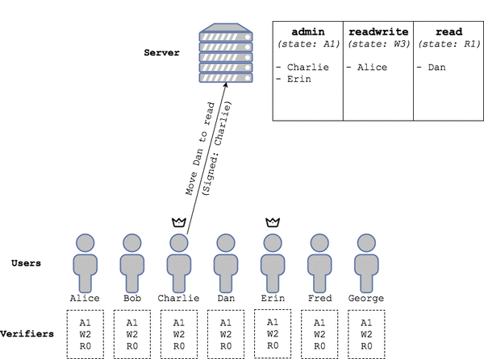

Because Charlie is in A1, the request is valid. Decompose it into two proofs, W2-Dan = W3, and R0+Dan=R1.

## Server emits proof + state change, floods
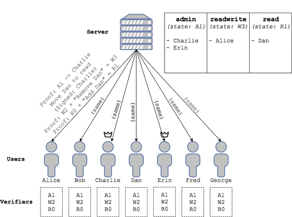

## Verifiers accept the proofs and apply the mutations
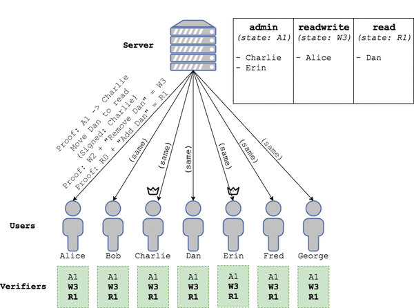

## Consistent view

## Server emits false proof and fraudulent mutation to all
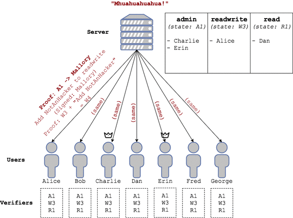

Proof: Mallory is in A1 (false). Mutation: add "NotAHacker" to read/writers.

## Verifiers do not find Mallory in A1

Thus the fraudulent mutation is refused.

## State remains consistent and unmodified

