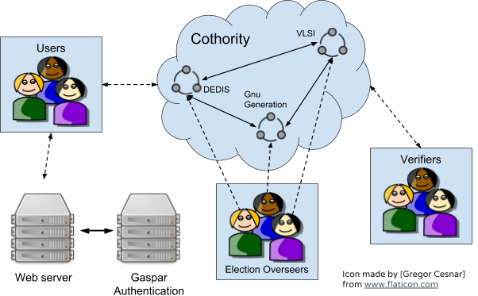
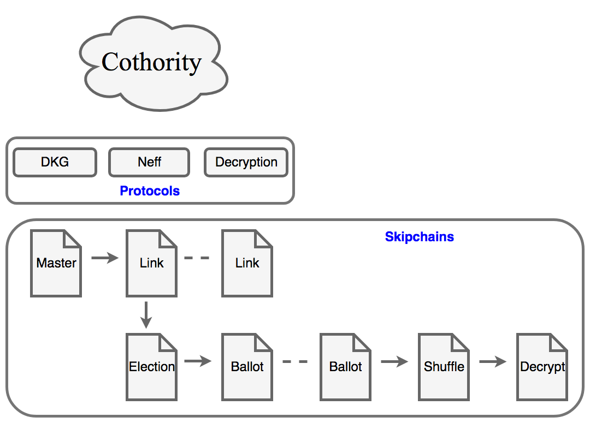

Navigation: [DEDIS](https://github.com/dedis/doc/tree/master/README.md) ::
[Cothority](../README.md) ::
[Apps](../doc/Applications.md) ::
E-voting

# E-voting

Our e-voting system is inspired by the first version of Helios where the encrypted
ballots are shuffled and anonymized before they are decrypted. Instead of the
shuffle used in Helios, we implemented a Neff shuffle which is much faster than
the original Helios shuffle.

To further reduce single points of failure we introduce the cothority and store
all the votes on a skipchain, so that they can be publicly verified by a third
party.

As this system is to be used in an [EPFL](https://epfl.ch) election, we added
an authentication to the Gaspar/Tequila service.

The evoting service has the following features:

* Distributed setup by election overseers
* Authentication through Tequila
* Anonymity of the votes through encryption on the client’s machine
* Tamper-proof storage of all votes on a blockchain
* Verifiable distributed shuffling using Neff-shuffles
* Shared decryption once the election is over
* Verifiability of the process by external verifiers

# Implementation

  

## Background

EPFL conducts elections across different departments and associations every year.
In fall, 2017, the DEDIS Lab at EPFL started working on implementing an evoting
systems to be used for Elections in May, 2018. The voting system aims to be
tamper-proof, auditable and decentralised.

## Decentralization
The evoting system runs on a set of nodes, which collectively perform all the
operations. The nodes, called conodes (https://github.com/dedis/cothority) make
extensive use of a custom blockchain implementation by the DEDIS Lab, called
Skipchains. Skipchains can be thought of as a distributed tamper resistant
datastore (as long as 2/3rds of the participating nodes are not malicious).
Addition of new data "blocks" to the chain must be ratified by 2/3rd majority
of participating nodes. We use skipchains to store information pertaining to
elections in the following way:

  

We have two levels of indirection -  the master skipchain and a per election
skipchain. The first block of the master skipchain holds configuration common
to all elections like the list of participating nodes in evoting, public key of
authorization server to verify signatures (refer to Identification section below),
IDs of administrators who’re allowed to setup new elections. Further blocks hold
a reference to the first block of an election specific skipchain and they’re
added when an election administrator proposes a new election.

The per-election skipchain’s first block contains information about the particular
information, such as the list of candidate IDs and eligible voter IDs. The election
creation protocol results in each node calculating a secret which it keeps to
itself (Distributed Key Generation). This secret is then used to construct an
aggregate public key for the election that is used to encrypt every voters ballot
for the election. The distribution of secret allows us to decentralise the
shuffling and voting process which is described later in the text.

## Identification
We rely on using EPFL’s authentication service, called Tequila to identify a user.
The identification process requires a central server that interacts with tequila
and generates a signature on successful authorization. The signature is held
on the web client in a cookie, and provided to the server with each operation.
The lead conode checks this signature. If it is valid, it proposes a new block
to the followers of the skipchain, seeking their approval. It signs the block
to certify that the user information in the transaction was seen and checked
by the lead conode.

This identification system is *not* decentralised. The lead conode is operated
by the same organisation that operates the authentication system
(VPSI, the central IT authority of the university). Once a transaction is proposed
to the non-leader conodes, the system is decentralised; it is up to each
conode to check (1) that the leader certified the user info, and (2) that the
invariants of a fair election are respected.

## Vote encryption
The evoting web application allows an administrator to set up a "choose M of N"
type of election. A voter may select his/her choice(s).

Before submitting the ballot to a conode, the web application encrypts the ballot
using the election's aggregate public key. The submission of an encrypted ballot
results in the addition of a new block to the skipchain. The block contains the
ID of the user who cast his/her vote and their vote in encrypted format. We
therefore notice that at this point, the evoting system prevents an adversary
from figuring out who a particular voter voted for but it doesn’t stop the
adversary from figuring out if they have voted or not voted at all. It should
also be noted that the current implementation does not allow a voter to verify
if their vote was cast as intended, i.e. if the encrypted ballot is not changed
while being transfered to the conode by a malware on their device. The voter can
however, verify if their vote is indeed stored or not in the skipchain.

## Shuffling and Decryption of Ballots
In order to preserve anonymity of votes, we need to remove voter information from
the encrypted ballots and permute and store them such that no adversary can
determine a vote from the shuffled permutation. At the same time, it is essential
that an auditor should be able to verify if the shuffling has been done correctly
and the nodes themselves have not acted maliciously. Neff Shuffles are well suited
for this task and provide a proof that allows auditors to verify that the shuffles
have been performed correctly.

After the shuffling phase, the ballots are anonymized but still encrypted. On
receiving a decryption request, every conode decrypts the ballot using their share of the secret.
These partial decryptions can then be used to reconstruct the fully decrypted ballots
(as long as a configurable threshold of nodes are able to verify the shuffle and
partially decrypt the ballots). The distribution in decryption phase gives no
single node full control over the decryption of ballots and to act maliciously.
Finally, the decrypted anonymised ballots are stored in the skipchain and they
can be used to aggregate the vote counts for each candidate.

# Usage

## Conodes

Run the conodes according to the instructions in the [conode](../conode/README.md) directory.

## Managing the master skipchain

The `evoting-admin` tool provides a way to manage the master skipchain for evoting.
See the [README.md](evoting-admin/README.md) in that directory.

# Links
- Student Project: EPFL e-voting:
  - [Backend](https://github.com/dedis/student_17/evoting-backend)
  - [Frontend](https://github.com/dedis/epfl-evoting/tree/master/evoting)
- Paper: **Verifiable Mixing (Shuffling) of ElGamal Pairs**; *C. Andrew Neff*, 2004
- Paper: **Helios: Web-based Open-Audit Voting**; *Ben Adida*, 2008
- Paper: **Decentralizing authorities into scalable strongest-link cothorities**: *Ford et. al.*, 2015
- Paper: **Secure distributed key generation for discrete-log based cryptosystems**; *Gennaro et. al.*, 1999

# Extension to more than 9 candidates

## Description

The pre-June 2023 version (v3.4.9) of the evoting backend only allowed for up to 9 choices of candidates.
This is due to the fact that the encryption is done with data in an ed25519 point, which can store up to
30 bytes.
Each candidate takes 3 bytes, so there would be 10 candidates possible, but probably due to a off-by-one error
decision, it was deemed better to only allow for 9 candidates.

With the current change, a number of `Additional*` fields are added to the structures that hold the encrypted
and decrypted votes.
This has been done as a golang-slice, which is represented as a `repeated` in protobuf.
The advantage is that if it is missing, it will simply result in a 0-length slice.
So all the previous data should be fully compatible with the new system.

The shuffling / mixing is now done with the `kyber/shuffle/sequences.go`, which has one big disadvantage:
**There is no verification of the shuffle being correct**!

Anyway, due to many other security bugs, I think this is the least of concerns for now...

## Bugs encountered

The following bugs are security bugs.
If the D-voting implementation is a rewrite of this evoting
service, then you should definitely check that now it's done
correctly!

- `hashMap` doesn't hash all it should: https://github.com/dedis/cothority/issues/2508
- The authentication of the user is very bogus: https://github.com/dedis/cothority/issues/2507
- `shuffle` and `decrypt` requests sent by the leader are not trustworthy: https://github.com/dedis/cothority/issues/2509
- Blocks created by `shuffle` and `decrypt` are signed with a useless signature https://github.com/dedis/cothority/issues/2510
