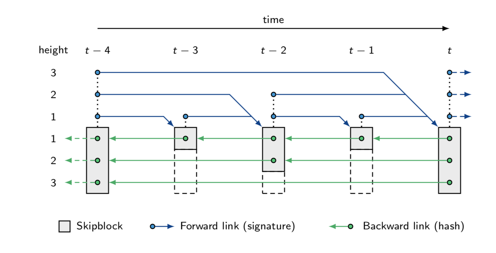

Navigation: [DEDIS](https://github.com/dedis/doc/tree/master/README.md) ::
[Cothority](../README.md) ::
[Building Blocks](../doc/BuildingBlocks.md) ::
Skipchain

# Skipchain implementation

> Skipchains are authenticated data structures that combine ideas from
> blockchains and skiplists. Skipchains enable clients
> to securely traverse the timeline in both forward and backward directions
> and to efficiently traverse short or long distances by employing
> multi-hop links. Backward links are cryptographic hashes of past blocks,
> as in regular blockchains. Forward links are cryptographic signatures of
> future blocks, which are added retroactively when the target block appears
> [1](https://www.usenix.org/system/files/conference/usenixsecurity17/sec17-nikitin.pdf).

This skipchain implementation is based upon the Chainiac-paper
[1](https://www.usenix.org/system/files/conference/usenixsecurity17/sec17-nikitin.pdf)
and offers a very simple and extendable voting-based permissioned blockchain.
Skipchain is used by - but not limited to - the following elements of the cothority:

- [byzcoin](../byzcoin) - a scalable Byzantine fault tolerant consensus
algorithm for open decentralized blockchain systems. It uses the skipchain as its
underlying data-structure for storing blocks.
- [caypso](../calypso) - a fully decentralized framework for auditable access control
on protected resources.
- [eventlog](../eventlog) - an auditable and secure logging service for byzcoin.
- [RandHound](https://github.com/dedis/paper_17_randomness) - a service that produce
verifiable random numbers and store them on a blockchain for later proofs.

The novelties of skipchains are the following:

- Delegation of trust from one block to the next: as the roster is stored in the
  block, the current nodes delegate trust to the next set of nodes
- Finality using forwardlinks: where other blockchains use proof-of-work and
  longest chain to define the latest state of the system, skipchains never
  change and don't allow for split views
- Short proofs: using only the hash of the genesis block (9cc3...), every node
  can return a proof that the latest block is valid by sending only the
  forward-links. In other systems you need to have your own trusted node follow
  the skipchain so you can be sure that the latest block is valid

and one thing that is not implemented, but described in Chainiac:

- Using multiple skipchains, where one holds the definition of the roster, while
  the other skipchain holds the actual transactions.

## Overview of implementation

### Networking transactions

The skipchain itself is held by one or more conodes. Clients can connect to the
leader and propose new blocks. Every time a new block is received, the leader
runs a BFT-protocol with the other conodes. All conodes keep a copy of the
skipchain-blocks.

### Skipchain data-structure

A skipchain block is made of the following struct:

```go
struct {
	// Index of the block in the chain. Index == 0 -> genesis-block.
	Index int
	// Height of that SkipBlock, starts at 1.
	Height int
	// The max height determines the height of the next block
	MaximumHeight int
	// For deterministic SkipChains, chose a value >= 1 - higher
	// bases mean more 'height = 1' SkipBlocks
	// For random SkipChains, chose a value of 0
	BaseHeight int
	// BackLink is a slice of hashes to previous SkipBlocks
	BackLinkIDs []SkipBlockID
	// VerifierID is a SkipBlock-protocol verifying new SkipBlocks
	VerifierIDs []VerifierID
	// GenesisID is the ID of the genesis-block. For the genesis-block, this
	// is null. The SkipBlockID() method returns the correct ID both for
	// the genesis block and for later blocks.
	GenesisID SkipBlockID
	// Data is any data to be stored in that SkipBlock
	Data []byte
	// Roster holds the roster-definition of that SkipBlock
	Roster *onet.Roster
	Hash SkipBlockID

	// Dynamic part that is updated afterward and not used
	// to compute the hash:

	// ForwardLink will be calculated once future SkipBlocks are
	// available
	ForwardLink []*ForwardLink

	// Payload is additional data that needs to be hashed by the application
	// itself into SkipBlockFix.Data. A normal use case is to set
	// SkipBlockFix.Data to the sha256 of this payload. Then the proofs
	// using the skipblocks can return simply the SkipBlockFix, as long as they
	// don't need the payload.
	Payload []byte `protobuf:"opt"`
}
```

**Height**

When the `BaseHeight` value is greater than 1, the height is computed deterministically.
In this case, the height of a skipblock is computed at its creation and is based on `MaxHeight`,
`BaseHeight`, and the `index` of the block.

This value determines how many elements the `ForwardLinks` and `BackwardLinks` arrays
of a block will/can contain.

The height value `height(i)` of a block whose index is `i` can be computed by the following function:

```
height(i):
  if i % BaseHeight == 0:
      return 1 + height(i/BaseHeight)
  else:
      return 1
```

where the value should not be greater than `MaxHeight`.


As an example, here is the list of blocks and their associated heigths with
`BaseHeight = 3` and `MaxHeight = 4`:

```

Block index  1   2   3   4   5   6   7   8   9  10  11  12  13  14  15  16  17  18  19  20  21  22  23  24  25  26  27  28..
Block height 1   1   2   1   1   2   1   1   3   1   1   2   1   1   2   1   1   3   1   1   2   1   1   2   1   1   4   1..

```

From the previous example, let's detail how the height of the block whose index is 18 is computed:

```
height(18) = 1 + height(18/3)
           = 1 + height(6)
           = 1 + 1 + height(6/3)
           = 1 + 1 + height(2)
           = 1 + 1 + 1
           = 3
```

Finally, here is an illustration taken from the paper [1](https://www.usenix.org/system/files/conference/usenixsecurity17/sec17-nikitin.pdf), where `BaseHeight = 2` and `MaxHeight = 3`:



## Usage

A simple first step on how to use skipchains is described in the
skipchain-manager readme: [SCMGR](../scmgr/README.md).

# Catch-up Behavior

If the conode is a follower for a given skipchain, then when it is asked to add
a block onto that skipchain by the leader, it will contact other conodes in the
last known roster for that skipchain in order to get copies of blocks that it is
missing. Once it has followed the skipchain to the latest block mentioned in the
proposed update, it will add the proposed block.

If the conode is a leader on a skipchain, when it is asked to add a block with a
latest block id that it does not know, it will attempt to catch up from other
conodes in the last known roster of the skipchain. If it can find the latest
block requested by the client from another member of the cothority, then it will
catch up to that block, and start the process of adding the block (i.e. request
that other conodes sign the block, and sign forward links to it, adding the
block into the chain). If the client proposes a block for a skipchain that is
not known to the conode, it will not attempt to catch up with other conodes.

Thus, it is imperative that the leader's DB is backed up regularly. Even though
it is possible that the leader can recover from peers, genesis blocks (which
start new skipchains) can *only* be backed up via out-of-band methods of
protecting the integrity of the leader's DB file.
